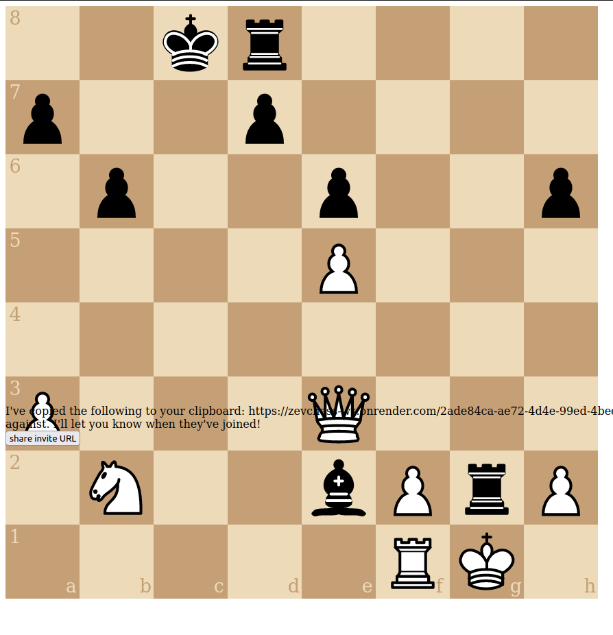
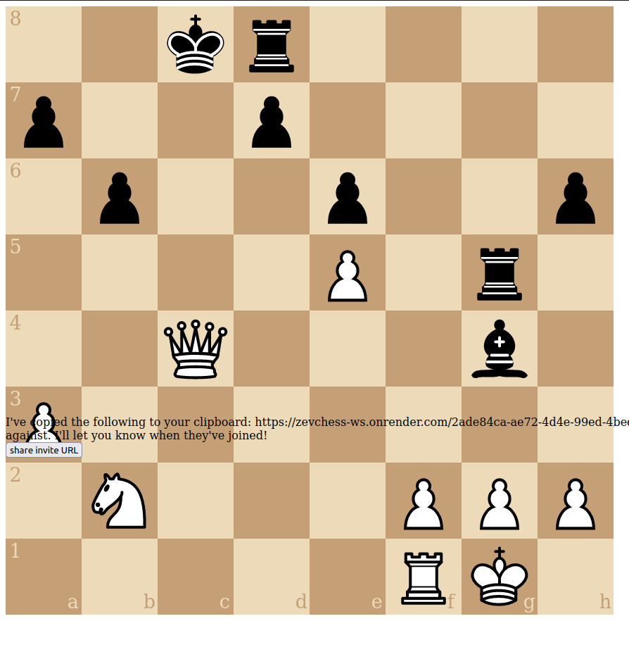
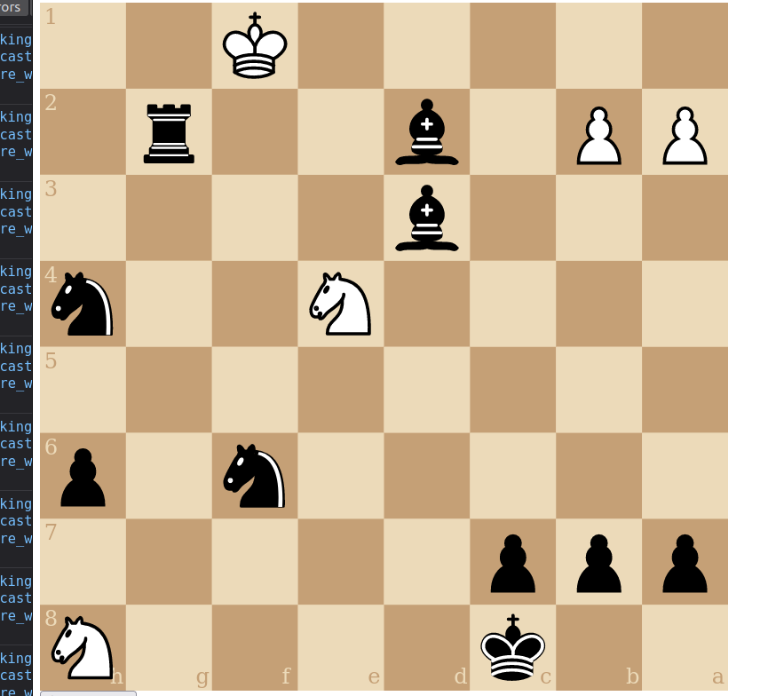

- [x] this should be checkmate: 
  - 2k4N/ppp5/5n1p/8/4N2n/3b4/PP1b2r1/5K2
  - the board before that: 2k4N/ppp5/5n1p/8/4N2n/8/PPbb2r1/5K2
    - the last move was c2 to d3 (bishop)
  - there were no console errors in either browser, but the move never got reported to white's browser
  - i'm pretty sure this did get registered as checkmate but the server disconnected too fast
    - for this reason I'm not disconnecting in game_over
- [x] pawn promotion! (websockets and web view)
  - [x] maybe use native `dialog` [link](https://developer.mozilla.org/en-US/docs/Web/HTML/Element/dialog)
- [x] deploy
  - [x] spin up Redis instances
    - [x] prod
    - [x] dev
  - [x] spin up postgres instances
    - [x] prod
    - [x] dev
  - [x] make script for initializing postgres DB
    - [x] run it on 
      - [x] dev (locally)
      - [x] prod
  - [x] replace hardcoded assets with env vars
    - [x] db connection
    - [x] redis connection
  - [x] refactor DB operations to postgres
  - [x] make a separate requirements-prod.txt
  - [x] create a web service for the API
    - [x] add gunicorn
  - [x] create a web service for the websocket server
- websocket API
  - [x] wrong number of watchers is shown once someone leaves (seems like it's not always decrement, or else maybe it's including the players once there's been more than one watcher?)
  - [x] "someone has left chat" is the message shown when a watcher leaves! (also wrong count)
  - [x] send entire game state at start of game, including to players
  - [x] who abandoned the game? there's some confusion here
    - "black abandoned the game, so white wins!" -- this happens when white abandons

- [x] create a basic DB
  - [x] use sqlite for completed games
    - [x] fields: uid and moves
    - [x] a function to store a completed game
  - [x] use Redis at first for the active games
    - [x] make a list for each active game
        - [x] key is "game_<uid>"
        - [x] value is list of verbose moves (originating square, pieces, destination square)
    - [x] make a hash for each game
        - [x] key is "game_<uid>"
        - [x] values are key/values
            - [x] half_moves: int
            - [x] turn: 0/1
            - [x] white_can_castle_queenside
            - [x] black_can_castle_queenside
            - [x] white_can_castle_kingside
            - [x] black_can_castle_kingside
            - [x] half_moves_since_last_capture: null/moveNum
            - [x] board: probably a FEN
- [x] create logic for
  - [x] create game
  - [x] make move
    - [x] validate move
        - [x] pawn
            - [x] en passant
        - [x] rook
        - [x] bishop
        - [x] queen
        - [x] king
        - [x] knight
            - [x] write tests
        - [x] is it check?
        - [x] if castling, would it sweep through check?
    - [x] persist move
    - [x] update game state
        - see "make a hash for each game"
    - [x] test "get all legal moves"
        - [x] en passant results in the captured piece actually disappearing
        - [x] king is prohibited from putting himself into check, especially with another king
    - [x] check if game is over
        - [x] is it stalemate? (no possible moves and check is False)
        - [x] is it checkmate? (no possible moves and check is True)
        - [x] if it is, persist it to "completed_games" (sqlite)
    - [x] pawn promotion
        - [x] implement it

- [x] create a basic web API
  - [x] HTTP
    - [x] /game
      - [x] POST
         - [x] /create
  - [x] websockets
     - [x] there's a bug (Feb 5, 2023) where some invalid chars are sent but a) somehow this doesn't produce an error and 'continue' and b) the sender gets disconnected. Possibly I just fat-fingered this and disconnected myself, BUT the game didn't get set as "abandoned" when it happened, which points to an actual bug.
        - resolved on Feb 6, 2023 with commit c510c4f51e61c0b4a555016bf70de46056391837
     - [x] use the [websockets][1] library, at first without concerning yourself with authentication
     - [x] events
         - [x] handle abandoned games
           - [x] remove from redis, (maybe) add to db
         - [x] join
         - [x] resign
         - [x] draw
            - [x] requested
            - [x] accepted 
         - [x] move
            - [x] try stalemate
            - [x] try the fool's mate, make sure it goes
                - f2-f3, e7-e5, g2-g4, Qd8-Qh4
            - [x] on success, return to whoever's turn it is
                - [x] all possible moves
                - [x] new game state
                - [x] from/to of prev move
            - [x] don't allow someone to make a move who isn't attached to a game! (different UID)
            - [x] say "it's your turn" to whoever's turn it is, i guess as a separate message
            - [x] provide the game state to new watchers
            - [x] don't allow a websocket connection to 'join' a game if it already has joined one
            - [x] don't allow if there's only one player
            - [x] don't allow if the game is over
            - [x] don't allow a player to move out of turn
            - [x] don't allow a spectator to make a move

  - [x] mark 'winner' field of game state when there's a resignation
  - [x] update 'existing_uids' redis list as games end
  - [x] BUG: when leaving/refreshing the browser, the game gets removed but somehow remains as a link on the home screen
    - this might be because of the bullet point above

- [x] create a basic web interface
  - [x] /
    - [x] when you click on the create game button it automatically brings you to that new URL
    - [x] list of active games, each joinable
  - [x] /<uid>
    - [x] render the board
    - [x] use [cm-chessboard][3] which has event handlers
    - [x] connect the board!
        - [x] when a piece moves, trigger a ws message
        - [x] freeze the pieces when it's not that player's turn
        - [x] turn the board around for black
          - [x] get which player the ws is for, set that as a global var
    - [x] only allow legal moves
      - [x] check possible_moves as delivered with 'your_turn' event
      - [x] check castling (what does that look like from the board, 'o-o' or?
    - [x] support castling
       - [x] move the rook automatically
       - [x] deliver the move accurately to the server
       - [x] make sure it's shown on opponent's/watchers' boards
       - [x] don't let castling happen more than once!
    - [x] make captures work (have to deliver 'capture' arg to ws server)
    - [x] connect to websocket server
    - [x] 'invite' button which copies the URL to your clipboard
    - [x] a debug box to show the websocket messages getting sent/received

- [x] BUG: white king can't capture rook here??
  - 
  - related: 
- [x] BUG: this isn't check??
  - 
  - 
- [x] BUG: there are a bunch of error messages on websocket server
  - [link](https://dashboard.render.com/web/srv-cfuuh9t3t39doaurs5q0/logs)
- [x] BUG: this isn't checkmate?
  - 
  - i can't replicate it (test_make_move_bug_11)

- [x] en passant
  - [x] for black, it's not showing up as a possbile move
  - [x] for white, the captured piece isn't disappearing
    - [x] add en passant logic to "case: success" clause
    - [x] figure out why `board.removePiece` isn't getting found (added it to chessground)
  - [x] show the allowed moves 
    - https://shaack.com/projekte/cm-chessboard/examples/validate-moves.html
    - [x] normal moves
    - [x] en passant
    - [x] castling
  - [x] fill the screen on mobile
  - [x] warn when closing the tab/window, instead of allowing resume
  - [x] indicate checkmate
  - [x] indicate check
  - [x] indicate stalemate

[1]: https://websockets.readthedocs.io/en/stable/intro/index.html
[2]: https://websockets.readthedocs.io/en/stable/topics/authentication.html
[3]: https://github.com/shaack/cm-chessboard#enablemoveinputeventhandler-color--undefined
