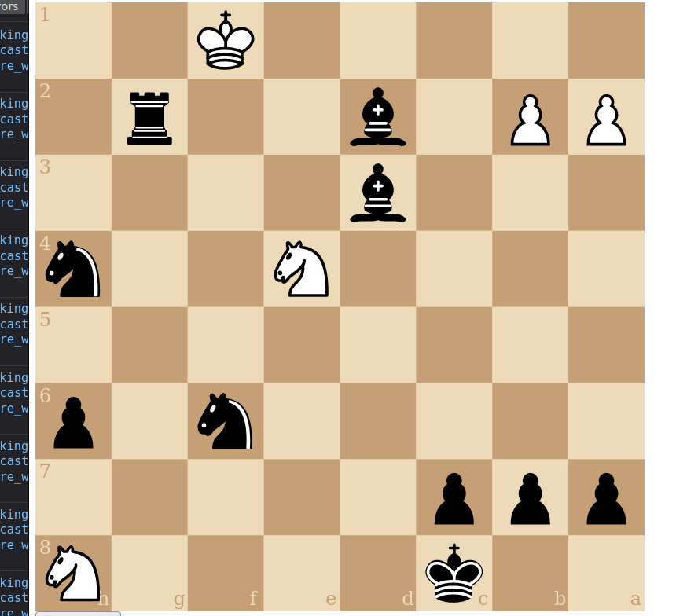

- [ ] pawn promotion! (websockets and web view)
  - maybe use native `dialog` [link](https://developer.mozilla.org/en-US/docs/Web/HTML/Element/dialog)
- [ ] enforce move limit (draw)
- [ ] threefold repetition

# small UI improvements
  - [x] show the allowed moves 
    - https://shaack.com/projekte/cm-chessboard/examples/validate-moves.html
  - [x] fill the screen on mobile
  - [x] warn when closing the tab/window, instead of allowing resume
  - [x] indicate checkmate
  - [x] indicate check
  - [x] indicate stalemate
  - [ ] shade the selected piece/background
  - [ ] don't show the actual UIDs on the main screen, if at all
  - [ ] add instructions for inviting a friend

# Bugs
  - [ ] BUG: when 'abandoning' the game, that side's king gets highlighted in red
  - [ ] BUG: why does the checkmated player automatically disconnect?
    - it currently causes a "white abandoned the game" message which has to be ignored on the front end
  - [ ] BUG: there's a bunch of stray UIDs on the home screen, they're getting stuck in Redis 
  - [ ] BUG: on dev server it says 'game not found' when creating a new game
  - [ ] silent BUG: there are still various errors showing in the log
    - [ ] make the log appear in prod?

## Done
- [x] BUG: white king can't capture rook here??
  - 
  - related: 
- [x] BUG: this isn't check??
  - 
  - 
- [x] BUG: there are a bunch of error messages on websocket server
  - [link](https://dashboard.render.com/web/srv-cfuuh9t3t39doaurs5q0/logs)
- [x] BUG: this isn't checkmate?
  - 
  - i can't replicate it (test_make_move_bug_11)
