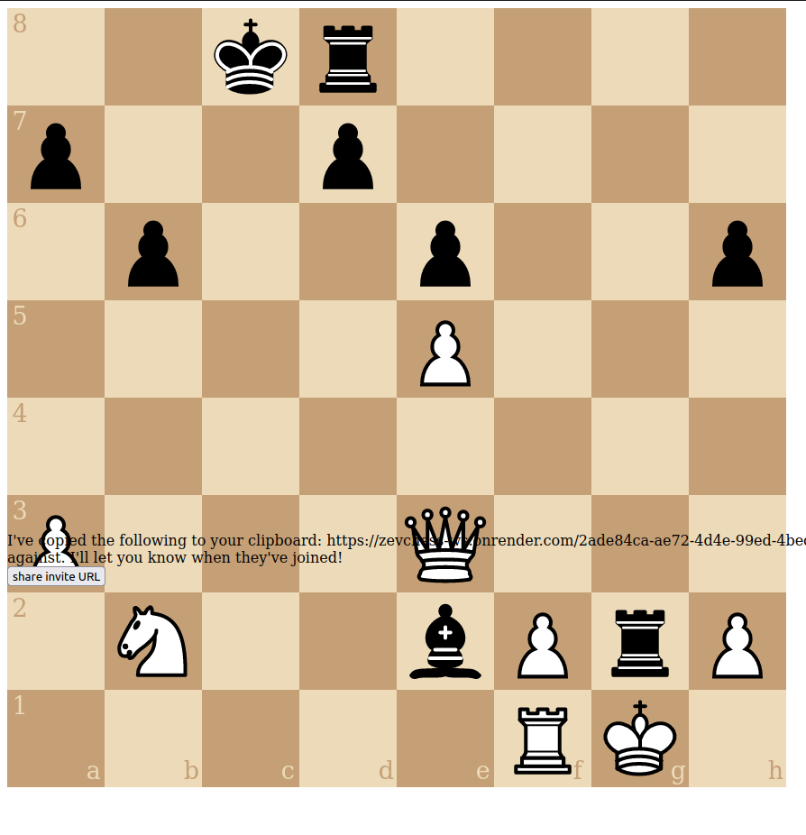
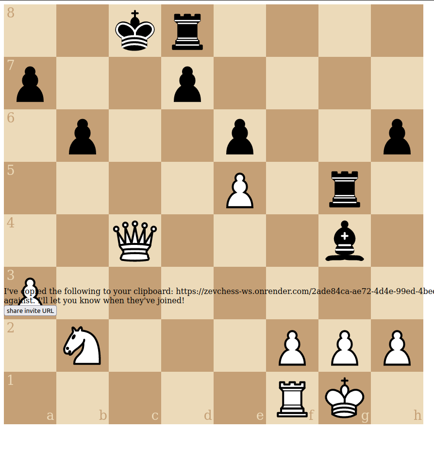

- [ ] pawn promotion! (websockets and web view)
  - maybe use native `dialog` [link](https://developer.mozilla.org/en-US/docs/Web/HTML/Element/dialog)
- [ ] move history
- [ ] make a way to walk through a bunch of pre-determined moves for testing purposes

# Bugs
  - [ ] BUG: this isn't checkmate?
    - 
    - i can't replicate it (test_make_move_bug_11)
  - [ ] BUG: when 'abandoning' the game, that side's king gets highlighted in red
  - [ ] BUG: there are a bunch of error messages on websocket server
    - [link](https://dashboard.render.com/web/srv-cfuuh9t3t39doaurs5q0/logs)
  - [ ] BUG: why does the checkmated player automatically disconnect?
    - it currently causes a "white abandoned the game" message which has to be ignored on the front end
  - [ ] BUG: on dev server it says 'game not found' when creating a new game
  - [ ] BUG: there's a bunch of stray UIDs on the home screen, they're getting stuck in Redis 
  - [x] BUG: white king can't capture rook here??
    - 
    - related: 
  - [x] BUG: this isn't check??
    - 
    - 

# small UI improvements
  - [ ] show the allowed moves [link][4]
  - [x] indicate checkmate
  - [x] indicate check
  - [x] indicate stalemate
  - [ ] show what players/watchers are there
[4]: https://shaack.com/projekte/cm-chessboard/examples/validate-moves.html
